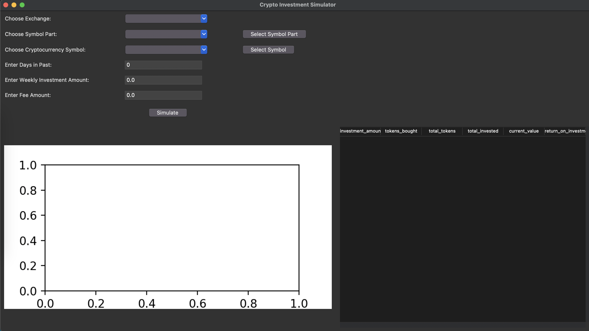
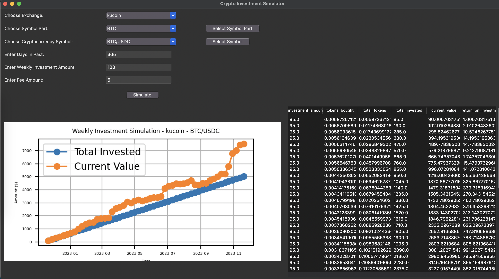

Certainly! Below is a sample README document that explains the functionality of the Crypto Investment Simulator app. Feel free to modify it according to your specific details and preferences.

---

# Crypto Investment Simulator

Written and maintained by Max Paul
https://www.linkedin.com/in/max-k-paul/

## Overview

The Crypto Investment Simulator is a Python application that allows users to simulate and visualize their investments in the cryptocurrency market. The application provides a user-friendly interface for selecting various parameters, running simulations, and analyzing investment outcomes.

- Home Area upon loading the application
[](readme-resources/app-main.png)

- View of application after rendering data
[](readme-resources/app-main-data.png)


## Features
- Select the crypto exchange of your choice
- select pairs of your choice


### Simulation Parameters

- Enter the number of days in the past for historical data analysis.
- Specify the weekly investment amount and transaction fee.

### Cryptocurrency Mode

- Select the cryptocurrency exchange from a dropdown list.
- Choose the symbol part to filter available symbols.
- Further narrow down the selection by choosing a specific symbol.

### Stocks Mode

- Select a symbol from a dropdown list for stock market simulations.

### Simulation and Visualization

- Click the "Simulate" button to run the investment simulation.
- View simulation results, including the total invested amount, current value, and return on investment, in a dynamic table.
- Visualize the investment progress over time with an interactive plot.

## Installation

1. Clone the repository to your local machine:

   ```bash
   git clone https://github.com/your-username/crypto-investment-simulator.git
   ```

2. Install required dependencies:

   ```bash
   pip install -r requirements.txt
   ```

## Usage

1. Navigate to the project directory:

   ```bash
   cd crypto-simulator
   cd src
   ```

2. Run the application:

   ```bash
   python main.py
   ```

3. Use the graphical interface to select simulation parameters and run simulations.

## Dependencies

- [ccxt](https://github.com/ccxt/ccxt): A cryptocurrency trading library.
- [Matplotlib](https://matplotlib.org/): Plotting library for visualizations.

## License

This project is licensed under the MIT License - see the [LICENSE](LICENSE) file for details.

## Acknowledgments

- This project makes use of the ccxt library. Special thanks to their contributors.

---
